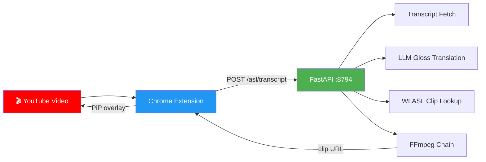

# GenASL — AI-Powered ASL Overlay Generator

GenASL is a proof-of-concept AI system that converts YouTube video transcripts into real-time American Sign Language (ASL) overlays for Deaf and Hard of Hearing (DHH) viewers. It runs as a **Chrome extension** backed by a local **FastAPI server** that orchestrates LLM translation, WLASL clip lookup, and FFmpeg video chaining.



## How It Works

1. **Transcript Ingestion** — Fetches timestamped transcript segments from YouTube via `youtube-transcript-api` with a `yt-dlp` fallback. Normalizes, deduplicates, and groups segments by pause gaps.
2. **Gloss Translation** — An LLM (Ollama / Gemini / OpenAI) translates English text into ASL gloss notation using a compact, few-shot prompt. Batch mode translates entire transcripts in chunks of 10.
3. **Clip Lookup & Chaining** — Each gloss word is matched against a 2,000-word WLASL manifest. Found clips are concatenated with FFmpeg into a single MP4.
4. **Real-Time Overlay** — The Chrome extension plays timed ASL clips in a Picture-in-Picture overlay synchronized with the YouTube video (pause, play, seek, speed).

## Repository Structure

```
asl-gen/
├── config.yaml                  # Pipeline & LLM configuration
├── requirements.txt             # Python dependencies
├── assets/
│   ├── wlasl_clips/             # 2,000 WLASL sign language clips
│   ├── word_manifest.json       # Gloss → clip path mapping
│   └── chained/                 # FFmpeg output cache
├── chrome-extension/            # Manifest V3 Chrome extension
│   ├── manifest.json
│   ├── content.js               # YouTube overlay injection
│   ├── popup.html / popup.js    # Extension popup UI
│   └── overlay.css              # Overlay styling
├── docs/                        # Pipeline documentation (see below)
├── src/
│   ├── api/server.py            # FastAPI server (port 8794)
│   ├── transcript_ingestion/    # YouTube transcript fetching
│   ├── gloss/                   # Translator, word lookup, chainer
│   ├── compositor/              # FFmpeg PiP overlay (standalone)
│   ├── matcher/                 # FAISS semantic matching (standalone)
│   └── pipeline/                # End-to-end orchestration (standalone)
├── tests/                       # 48 unit and integration tests
└── transcripts/                 # Cached transcript JSON files
```

## Documentation

Detailed pipeline documentation with Mermaid flow diagrams:

| Document | Description |
|----------|-------------|
| [Architecture Overview](docs/architecture-overview.md) | System architecture, component map, sequence diagrams, technology stack |
| [Transcript Ingestion](docs/transcript-ingestion.md) | Two-tier fetcher, normalization pipeline, caching strategy |
| [Gloss Translation Pipeline](docs/gloss-translation-pipeline.md) | LLM providers, prompt design, batch chunking, output sanitization |
| [Clip Chaining & Overlay](docs/clip-chaining-and-overlay.md) | WLASL lookup, FFmpeg concatenation, PiP compositor, adaptive speed |
| [Chrome Extension](docs/chrome-extension.md) | Content script lifecycle, playback sync, popup controls, overlay DOM |
| [API Server](docs/api-server.md) | Endpoints, request/response models, caching, CORS, thread pool |

## Prerequisites

- Python 3.10+
- FFmpeg (on PATH)
- One LLM provider: [Ollama](https://ollama.com/) (local) or a Gemini/OpenAI API key

## Setup

```bash
# 1. Clone the repository
git clone <repo-url>
cd asl-gen

# 2. Create a virtual environment
python -m venv .venv
# Windows
.venv\Scripts\activate
# macOS / Linux
source .venv/bin/activate

# 3. Install dependencies
pip install -r requirements.txt

# 4. (If using Gemini) Set API key
#    Windows PowerShell:
$env:GEMINI_API_KEY = "your-key-here"
#    Linux/macOS:
export GEMINI_API_KEY="your-key-here"
```

## Configuration

All tuneable parameters live in `config.yaml`:

| Key | Description | Default |
|-----|-------------|---------|
| `llm.provider` | LLM backend (`ollama`, `gemini`, `openai`) | `gemini` |
| `llm.ollama.model` | Ollama model name | `gemma3:4b` |
| `llm.gemini.model` | Gemini model name | `gemini-2.0-flash` |
| `matcher.confidence_threshold` | Minimum semantic match score | `0.80` |
| `paths.wlasl_clips` | WLASL clip directory | `assets/wlasl_clips/` |

See [Architecture Overview — Configuration Reference](docs/architecture-overview.md#configuration-reference) for the full list.

## Quick Start

### Chrome Extension Mode (primary)

```bash
# 1. Start the API server
python -m src.api.server

# 2. Load the Chrome extension
#    chrome://extensions → Developer mode → Load unpacked → select chrome-extension/

# 3. Navigate to any YouTube video — the ASL overlay appears automatically
```

### Standalone Mode

```bash
# Run the full pipeline for a YouTube video
python -m src.pipeline.run_pipeline
```

## Running Tests

```bash
pytest tests/ -v
```

## License

This project is licensed under the [GNU General Public License v3.0](LICENSE).
