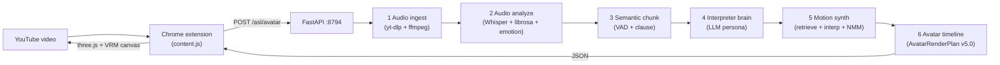

# GenASL — Interpreter-Avatar ASL Overlay

GenASL is an AI pipeline that watches what a YouTube video says and generates a 3D
American Sign Language **interpreter avatar** as a Picture-in-Picture overlay,
mimicking how a real ASL interpreter listens, interprets, and signs.

The architecture is a **retrieval-augmented hybrid**: an LLM decides *what* to sign
(grammar, role shifts, emphasis, non-manual markers) from speech + prosody +
emotion, then a motion synthesiser drives a Ready Player Me VRM avatar in the
browser via three.js + @pixiv/three-vrm. Every hand pose traces back to a real
Deaf-signer recording; the AI orchestrates known-good primitives rather than
hallucinating signs from scratch.


```mermaid
flowchart LR
  YT["YouTube video"] --> EXT["Chrome extension<br/>(content.js)"]
  EXT -- "POST /asl/avatar" --> API["FastAPI :8794"]
  API --> A1["1 Audio ingest<br/>(yt-dlp + ffmpeg)"]
  A1 --> A2["2 Audio analyze<br/>(Whisper + librosa + emotion)"]
  A2 --> S3["3 Semantic chunk<br/>(VAD + clause)"]
  S3 --> S4["4 Interpreter brain<br/>(LLM persona)"]
  S4 --> S5["5 Motion synth<br/>(retrieve + interp + NMM)"]
  S5 --> S6["6 Avatar timeline<br/>(AvatarRenderPlan v5.0)"]
  S6 -- "JSON" --> EXT
  EXT -- "three.js + VRM canvas" --> YT
```

> **Status: prototype in build-out.** Phase 1 (bootstrap) is done; the v5.0
> schema, settings, and skeleton are landed. Phases 2–7 wire the actual
> stages. See [`docs/plan/`](docs/plan/) for the full per-phase roadmap and
> [`business/feasibility-study/`](business/feasibility-study/) for the
> strategic and architectural rationale that drove this design.

---

## Why this design

ASL is not a word-for-word substitute for English captions — it has its own grammar
(topic-comment word order, classifier predicates, role shifts) and a parallel
non-manual marker (NMM) channel (facial expression, head tilt, body lean) that
carries grammatical meaning, not just affect. Pure neural sign synthesis (SignDiff,
T2S-GPT) is improving fast but still produces visible artefacts that the Deaf
community has documented and rejected. GenASL solves the same problem with a
hybrid: an interpreter-brain LLM produces a structured *plan*, the motion
synthesiser pulls actual Deaf-signed motion clips for each sign in the plan, and
small generative steps smooth transitions and drive the NMM channel from prosody.
The result is deterministic, auditable, and bounded in its failure modes.

See [`business/feasibility-study/01-technology-feasibility.md`](business/feasibility-study/01-technology-feasibility.md)
for the full design rationale, and
[`business/feasibility-study/02-competitive-tech-comparison.md`](business/feasibility-study/02-competitive-tech-comparison.md)
for how this compares against Signapse, Hand Talk, SignAll, SignDiff, T2S-GPT,
and the captioning incumbents.

---

## Repository map

```
asl-gen/
├── README.md                       # this file
├── config.yaml                     # pipeline / model / avatar config
├── requirements.txt
├── business/                       # market analysis + feasibility study
│   ├── README.md
│   ├── 01..06-*.md                 # v1 market analysis
│   └── feasibility-study/
│       └── 01..05-*.md             # v2 feasibility study (recommended primary read)
├── docs/
│   ├── architecture-overview.md    # technical reference for the pipeline
│   └── plan/                       # AI-hand-off implementation roadmap
│       ├── README.md
│       ├── 00-architecture.md
│       └── phase-{1..7}-*.md       # one detailed plan per build phase
├── src/
│   ├── api/server.py               # FastAPI server (POST /asl/avatar)
│   ├── audio/source_video.py       # yt-dlp source MP4 fetch (Stage 1 input)
│   ├── core/{config,paths,ffmpeg,logging}.py
│   ├── llm/providers/              # Ollama / Gemini / OpenAI shared abstraction
│   └── pipeline/
│       ├── models.py               # v5.0 Pydantic schema
│       ├── pipeline_avatar.py      # InterpreterAvatarPipeline orchestrator
│       ├── run_pipeline.py         # CLI entry point
│       └── stages/                 # Stage ABC + concrete stages (Phases 2–5)
├── chrome-extension/               # MV3 extension; three.js avatar canvas (Phase 6)
├── scripts/
│   ├── download_wlasl_index.py     # WLASL metadata fetch (Phase 4)
│   └── export_cookies.py
├── assets/
│   ├── demo/                       # demo media (presentation, screenshots)
│   ├── word_manifest.json          # gloss → clip path map (Phase 4 input)
│   ├── wlasl_clips/                # Deaf-signer clips, source for the pose library
│   └── pose_library/               # extracted joint-angle JSON (Phase 4 output)
└── tests/                          # pytest — see `pytest tests/ -v`
```

---

## Quick start

### Prerequisites

- Python 3.10+
- FFmpeg on PATH
- One LLM provider: [Ollama](https://ollama.com/) (local) or a Gemini/OpenAI API key
- Google Chrome (for the avatar extension)

### Install

```bash
git clone <repo-url>
cd asl-gen
python -m venv .venv

# Windows PowerShell
.venv\Scripts\Activate.ps1
# macOS / Linux
source .venv/bin/activate

pip install -r requirements.txt

# Optional API keys
$env:GEMINI_API_KEY = "your-key"          # PowerShell
export GEMINI_API_KEY="your-key"           # bash/zsh
```

### Run the server

```bash
python -m src.api.server
# -> http://127.0.0.1:8794
```

Until Phases 2–5 land, `POST /asl/avatar` returns `503` with a clear "pipeline
not wired" payload. `GET /health` always works and reports build-out progress.

### Load the Chrome extension

```
chrome://extensions  →  Developer mode  →  Load unpacked  →  chrome-extension/
```

Browse to any YouTube video — the extension probes the API and (once Phase 7
lands) mounts the avatar canvas in a PiP overlay.

---

## Implementation roadmap

The full per-phase roadmap is in [`docs/plan/`](docs/plan/) and is written so
that any contributor (human or AI) can pick up a phase cold:

| Phase | What it delivers | Status |
|---|---|---|
| [1 — Bootstrap](docs/plan/phase-1-bootstrap.md) | Config sections, v5.0 schema, skeleton, mode toggle | **Done** |
| [2 — Audio backbone](docs/plan/phase-2-audio-backbone.md) | Whisper + librosa + emotion → `AudioAnalysis` | **Done** |
| [3 — Interpreter brain](docs/plan/phase-3-interpreter-brain.md) | LLM persona producing `AslPlanSegment` | **Done** |
| [4 — Pose library](docs/plan/phase-4-pose-library.md) | Mediapipe → per-gloss joint-angle JSON | Pending |
| [5 — Motion synthesis + NMM](docs/plan/phase-5-motion-synthesis.md) | Retrieve + spline + prosody-driven NMM | Pending |
| [6 — Chrome extension VRM](docs/plan/phase-6-chrome-extension-vrm.md) | three.js + @pixiv/three-vrm in PiP | Pending |
| [7 — API + end-to-end](docs/plan/phase-7-api-end-to-end.md) | `/asl/avatar` returns real plans on test videos | Pending |

---

## Running tests

```bash
pytest tests/ -v
```

The current suite (21 tests) covers the v5.0 schema, settings loading, the
stage caching ABC, and the LLM provider abstraction. Each new phase adds its
own tests; see the relevant `docs/plan/phase-*.md` file for what to add.

---

## License

[GNU General Public License v3.0](LICENSE)
