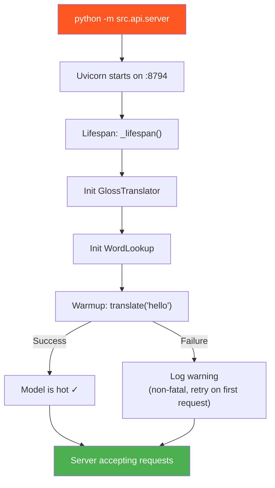
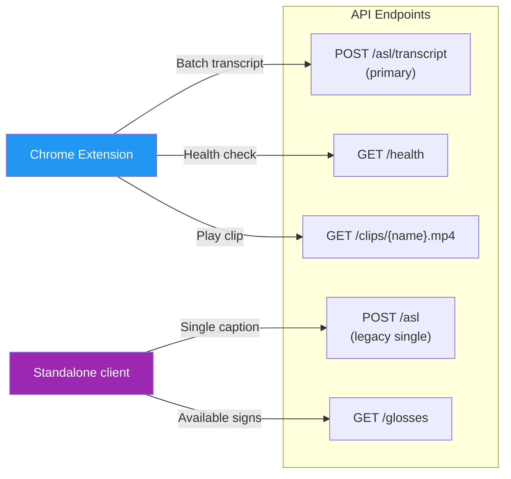
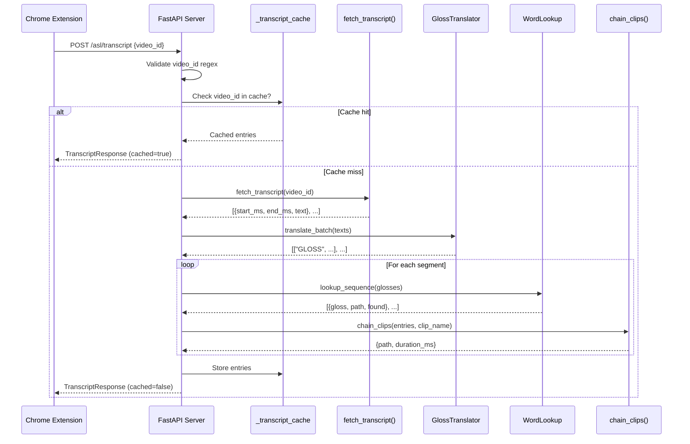
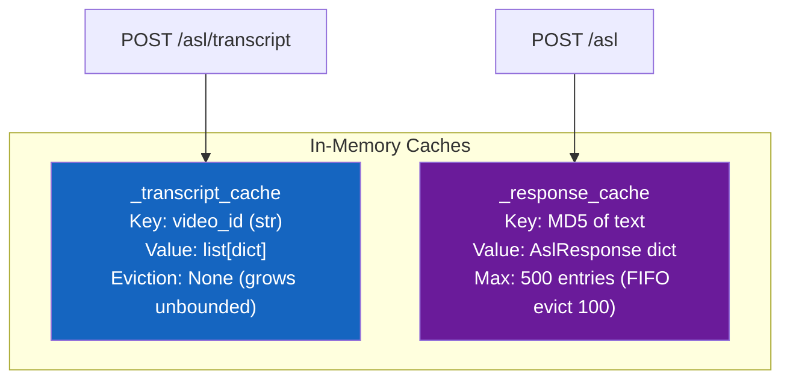
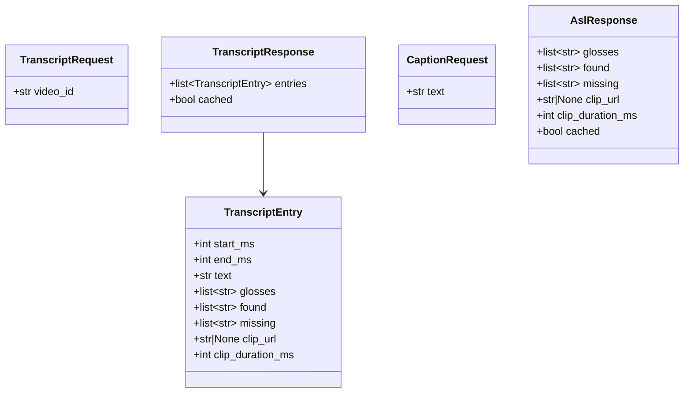

# API Server

> **Module:** `src.api.server`  
> **Framework:** FastAPI 0.115+  
> **Port:** `8794` (localhost only)  
> **Run:** `python -m src.api.server`

## Overview

The API server is the bridge between the Chrome extension and the Python pipeline. It receives transcript requests from the extension, orchestrates the full translate → lookup → chain pipeline, and serves the resulting video clips over HTTP.

---

## Server Startup



Warmup is performed in a thread pool executor so the async event loop isn't blocked. If the LLM provider is unreachable at startup, the server still starts — the first real request will trigger lazy initialization.

---

## Endpoint Map



---

## Endpoints

### `POST /asl/transcript` — Batch Transcript Translation

The primary endpoint used by the Chrome extension. Fetches the full transcript for a YouTube video, batch-translates all lines to ASL gloss, looks up clips, and chains them.

**Request:**
```json
{
  "video_id": "dQw4w9WgXcQ"
}
```

**Response (200):**
```json
{
  "entries": [
    {
      "start_ms": 1200,
      "end_ms": 4800,
      "text": "what is your name",
      "glosses": ["YOUR", "NAME", "WHAT"],
      "found": ["YOUR", "NAME", "WHAT"],
      "missing": [],
      "clip_url": "http://127.0.0.1:8794/clips/ext_abc123.mp4",
      "clip_duration_ms": 2850
    }
  ],
  "cached": false
}
```

**Error Responses:**
| Status | Condition | Body |
|--------|-----------|------|
| 400 | Invalid `video_id` format (must be 11 chars, `[A-Za-z0-9_-]`) | `{"error": "invalid video_id"}` |
| 404 | Transcript fetch or processing failed | `{"error": "transcript unavailable: ..."}` |

**Processing flow:**



---

### `POST /asl` — Single Caption Translation (Legacy)

Translates a single caption line. Used before the batch architecture was implemented.

**Request:**
```json
{
  "text": "what is your name"
}
```

**Response (200):**
```json
{
  "glosses": ["YOUR", "NAME", "WHAT"],
  "found": ["YOUR", "NAME", "WHAT"],
  "missing": [],
  "clip_url": "http://127.0.0.1:8794/clips/ext_abc123.mp4",
  "clip_duration_ms": 2850,
  "cached": false
}
```

---

### `GET /clips/{filename}` — Serve Chained Clips

Serves pre-chained MP4 files from `assets/chained/`. The Chrome extension uses clip URLs from transcript responses to load these.

**Security:** Path traversal protection — rejects filenames containing `/`, `\`, or `..`.

**Headers:**
- `Access-Control-Allow-Origin: *`
- `Cache-Control: public, max-age=3600`

---

### `GET /health` — Health Check

Returns server status and timestamp. Used by the extension popup.

**Response:**
```json
{
  "status": "ok",
  "time": 1719000000.123
}
```

---

### `GET /glosses` — Available Gloss List

Returns all ASL glosses available in the WLASL dataset.

**Response:**
```json
{
  "count": 1998,
  "glosses": ["ABOUT", "ABOVE", "ACCEPT", "..."]
}
```

---

## Caching Strategy



| Cache | Key | Used By | Max Size | Eviction |
|-------|-----|---------|----------|----------|
| `_transcript_cache` | `video_id` string | `/asl/transcript` | Unbounded | None |
| `_response_cache` | MD5 of normalized text | `/asl` | 500 entries | FIFO (oldest 100 removed) |

Both caches are in-memory only and reset on server restart.

---

## CORS Configuration

The server allows cross-origin requests from:

| Origin | Purpose |
|--------|---------|
| `https://www.youtube.com` | Chrome extension running on YouTube |
| `chrome-extension://*` | Extension popup and background script |
| `http://localhost:*` | Local development |
| `http://127.0.0.1:*` | Local development |

All HTTP methods and headers are allowed.

---

## Thread Pool Execution

All blocking pipeline operations (LLM calls, FFmpeg, file I/O) run in the default thread pool executor via `loop.run_in_executor(None, ...)`. This prevents the async event loop from being blocked during potentially slow operations like:

- LLM translation (100ms–10s depending on provider)
- FFmpeg clip concatenation (50–500ms per clip chain)
- Transcript fetching (500ms–3s)

---

## Data Models


