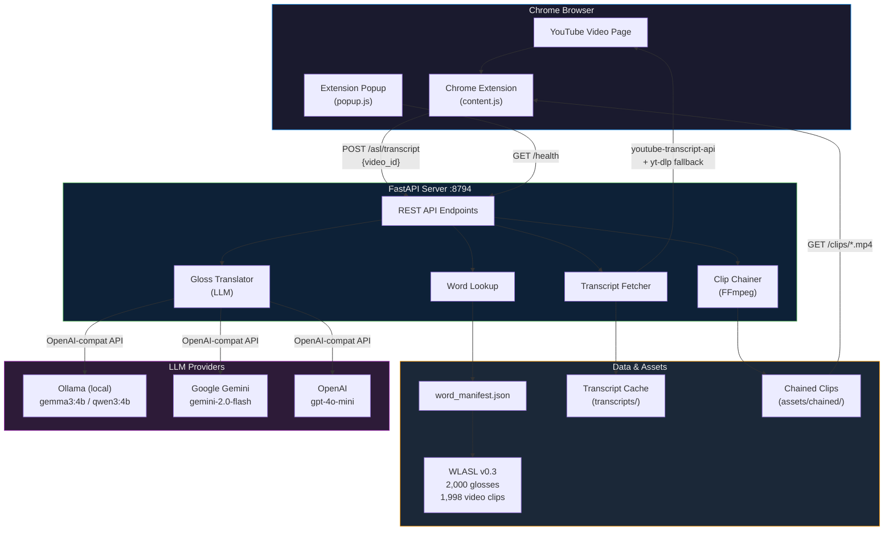
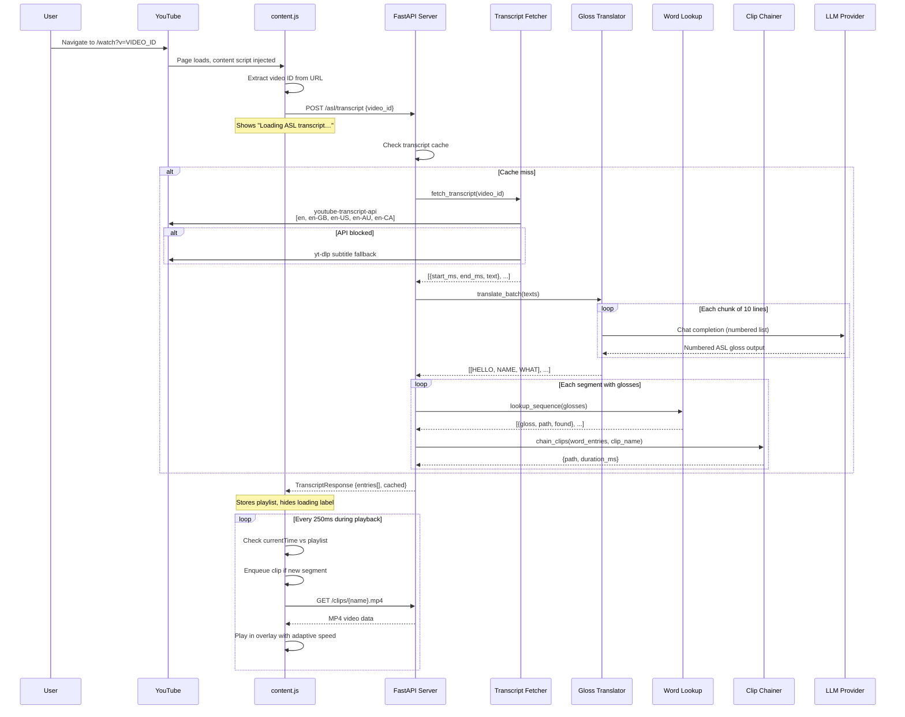
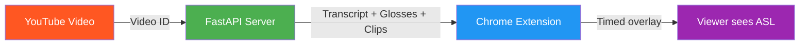
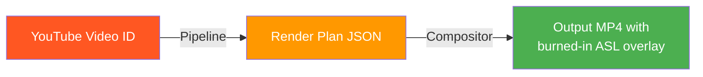

# GenASL — Architecture Overview

> **Version:** 1.0 — March 2026  
> **Status:** Proof of Concept

## System Summary

GenASL is an AI-powered pipeline that converts English YouTube video transcripts into timed American Sign Language (ASL) video overlays. It combines LLM-based gloss translation, a curated sign video library (WLASL), FFmpeg clip chaining, and a Chrome extension to deliver an accessible viewing experience for Deaf and Hard of Hearing (DHH) users.

---

## High-Level Architecture



---

## Request Flow — Batch Transcript Architecture

When a user navigates to a YouTube video, the entire transcript is fetched and translated in **one server call**. During playback, zero API calls are made.



---

## Component Map

| Component | Location | Language | Purpose |
|-----------|----------|----------|---------|
| **FastAPI Server** | `src/api/server.py` | Python | REST API bridging extension to pipeline |
| **Transcript Fetcher** | `src/transcript_ingestion/fetcher.py` | Python | YouTube transcript retrieval + normalization |
| **Gloss Translator** | `src/gloss/translator.py` | Python | LLM-based English → ASL gloss translation |
| **Word Lookup** | `src/gloss/word_lookup.py` | Python | Gloss → video clip path resolution |
| **Clip Chainer** | `src/gloss/chainer.py` | Python | FFmpeg concat demuxer for clip sequences |
| **Semantic Matcher** | `src/matcher/matcher.py` | Python | FAISS + sentence-transformers matching |
| **Pipeline Runner** | `src/pipeline/run_pipeline.py` | Python | End-to-end orchestration (standalone mode) |
| **PiP Compositor** | `src/compositor/compositor.py` | Python | FFmpeg Picture-in-Picture overlay composer |
| **Video Downloader** | `src/compositor/downloader.py` | Python | yt-dlp source video download |
| **Streamlit UI** | `src/ui/app.py` | Python | Web interface for standalone pipeline runs |
| **Chrome Extension** | `chrome-extension/` | JS/HTML/CSS | YouTube page overlay + playback sync |

---

## Two Execution Modes

GenASL supports two ways to produce ASL overlays:

### Mode 1: Real-Time Chrome Extension (Primary)



- **Use case:** Live YouTube viewing with ASL overlay
- **Latency:** ~60s initial load (transcript + translation + clip building), then zero
- **Output:** PiP overlay on YouTube player with pause/play/seek sync

### Mode 2: Offline Pipeline + Compositor (Standalone)



- **Use case:** Pre-rendered video production, testing, demo
- **Output:** Full MP4 file with ASL clips composited as PiP + disclosure label
- **Command:** `python -m src.pipeline.run_pipeline <VIDEO_ID>`

---

## Data Flow Summary

```
YouTube Video
    │
    ▼
┌───────────────────────┐
│  Transcript Ingestion  │  youtube-transcript-api → yt-dlp fallback
│  (fetcher.py)          │  Output: [{start_ms, end_ms, text}, ...]
└───────────┬───────────┘
            │
            ▼
┌───────────────────────┐
│  Gloss Translation     │  LLM converts English → ASL gloss
│  (translator.py)       │  "What's your name?" → [YOUR, NAME, WHAT]
└───────────┬───────────┘
            │
            ▼
┌───────────────────────┐
│  Word Lookup           │  Maps each gloss to a video clip file
│  (word_lookup.py)      │  YOUR → W1997_YOUR.mp4, NAME → W1264_NAME.mp4
└───────────┬───────────┘
            │
            ▼
┌───────────────────────┐
│  Clip Chaining         │  FFmpeg concat demuxer joins clips
│  (chainer.py)          │  [YOUR.mp4 + NAME.mp4 + WHAT.mp4] → chained.mp4
└───────────┬───────────┘
            │
            ▼
┌───────────────────────┐
│  Playback / Overlay    │  Chrome extension or FFmpeg compositor
│  (content.js / comp.)  │  Timed PiP overlay on YouTube video
└───────────────────────┘
```

---

## Technology Stack

| Layer | Technology | Version | Purpose |
|-------|-----------|---------|---------|
| **Runtime** | Python | 3.14.0 | Core pipeline language |
| **Web Server** | FastAPI + Uvicorn | Latest | Async REST API |
| **LLM Client** | openai (Python) | 2.24.0 | Unified client for all providers |
| **Transcript** | youtube-transcript-api | 1.2.4 | Primary transcript source |
| **Transcript (fallback)** | yt-dlp | Latest | Auto-subtitle extraction |
| **Embeddings** | sentence-transformers | 3.4.1 | MiniLM-L6-v2 encoder |
| **Vector Search** | faiss-cpu | 1.13.2 | Nearest-neighbour matching |
| **Video Processing** | FFmpeg | 8.0.1 | Clip chaining + PiP compositing |
| **Browser** | Chrome Extension | Manifest V3 | YouTube page injection |
| **UI** | Streamlit | Latest | Standalone web interface |
| **Testing** | pytest | 8.3.5 | 48 unit/integration tests |

---

## Configuration

All tuneable parameters live in [`config.yaml`](../config.yaml):

```yaml
llm:
  provider: "ollama"           # ollama | gemini | openai
  ollama:
    model: "gemma3:4b"         # Local model
    base_url: "http://localhost:11434/v1"
  gemini:
    model: "gemini-2.0-flash"  # Cloud model (needs GEMINI_API_KEY)
  openai:
    model: "gpt-4o-mini"       # Cloud model (needs OPENAI_API_KEY)

matcher:
  confidence_threshold: 0.80   # Minimum cosine similarity for ASL match
```

See the individual component documentation for detailed configuration options:
- [Transcript Ingestion](transcript-ingestion.md)
- [Gloss Translation Pipeline](gloss-translation-pipeline.md)
- [Clip Chaining & Overlay Delivery](clip-chaining-and-overlay.md)
- [API Server](api-server.md)
- [Chrome Extension](chrome-extension.md)
