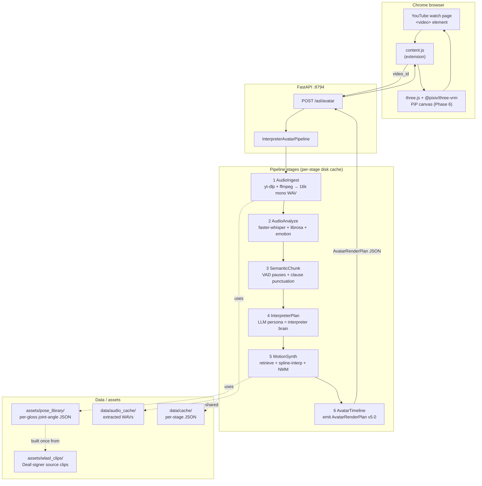

# GenASL — Architecture Overview

> **Status:** Phase 1 (bootstrap) landed; Phases 2–7 in build-out per
> [`docs/plan/`](plan/). This document is the **technical reference** for
> the system once fully wired. New contributors should read this *before*
> picking up a phase plan.

---

## 1. System summary

GenASL produces a **3D-avatar ASL interpreter overlay** for any YouTube video.
The Chrome extension asks the local FastAPI server for an `AvatarRenderPlan`
(schema v5.0). The server runs a six-stage pipeline that mimics how a human
interpreter works:

1. **Listen** — pull the source video's audio and run ASR + prosody +
   emotion analysis.
2. **Plan** — feed the analysed audio (text + prosody + emotion) to a
   "interpreter brain" LLM that produces a structured ASL plan (manual
   sign sequence + non-manual marker intent + emphasis + grammar).
3. **Sign** — retrieve real Deaf-signer motion clips for each sign in the
   plan, interpolate smoothly between them, and generate a parallel
   facial-blendshape track from prosody.
4. **Render** — return a JSON timeline; the extension drives a Ready Player
   Me VRM avatar in a PiP canvas, synced to the host `<video>` element.

The pipeline is **retrieval-augmented**: hand poses come from a curated
library extracted from Deaf-signer clips, not from a pure-generative model.
This is the most important architectural choice — see
[`business/feasibility-study/01-technology-feasibility.md`](../business/feasibility-study/01-technology-feasibility.md)
§ 1.5 for the rationale (determinism, auditability, bounded failure modes,
Deaf-community acceptance).

---

## 2. End-to-end flow


```mermaid
flowchart TB
  subgraph BROWSER["Chrome browser"]
    YT["YouTube watch page<br/>&lt;video&gt; element"]
    CS["content.js<br/>(extension)"]
    CANVAS["three.js + @pixiv/three-vrm<br/>PiP canvas (Phase 6)"]
  end

  subgraph SERVER["FastAPI :8794"]
    EP["POST /asl/avatar"]
    PIPE["InterpreterAvatarPipeline"]
  end

  subgraph STAGES["Pipeline stages (per-stage disk cache)"]
    direction TB
    S1["1 AudioIngest<br/>yt-dlp + ffmpeg → 16k mono WAV"]
    S2["2 AudioAnalyze<br/>faster-whisper + librosa + emotion"]
    S3["3 SemanticChunk<br/>VAD pauses + clause punctuation"]
    S4["4 InterpreterPlan<br/>LLM persona = interpreter brain"]
    S5["5 MotionSynth<br/>retrieve + spline-interp + NMM"]
    S6["6 AvatarTimeline<br/>emit AvatarRenderPlan v5.0"]
    S1 --> S2 --> S3 --> S4 --> S5 --> S6
  end

  subgraph DATA["Data / assets"]
    POSE["assets/pose_library/<br/>per-gloss joint-angle JSON"]
    WLASL["assets/wlasl_clips/<br/>Deaf-signer source clips"]
    AUDIO["data/audio_cache/<br/>extracted WAVs"]
    CACHE["data/cache/<br/>per-stage JSON"]
  end

  YT --> CS
  CS -- "video_id" --> EP
  EP --> PIPE --> S1
  S1 -.uses.-> AUDIO
  S5 -.uses.-> POSE
  POSE -.built once from.-> WLASL
  STAGES -.shared.-> CACHE
  S6 -- "AvatarRenderPlan JSON" --> EP
  EP --> CS --> CANVAS --> YT
```

---

## 3. Stages — contracts and responsibilities

Each stage subclasses `src.pipeline.stages.base.Stage[InT, OutT]` and ships its
output to the next stage as a typed Pydantic model. Every stage hashes its
input + relevant settings into a fingerprint and caches its output as JSON
under `data/cache/<stage_name>/<key>.json`, so reruns hit disk.

| # | Stage | Input | Output | What it does | Lands in |
|---|-------|-------|--------|--------------|----------|
| 1 | `AudioIngestStage` | `AudioIngestInput(video_id)` | `AudioIngestOutput(audio_path, duration_ms, sample_rate_hz)` | yt-dlp → MP4 → ffmpeg rip → 16 kHz mono WAV in `data/audio_cache/` | Phase 2 |
| 2 | `AudioAnalyzeStage` | `AudioAnalyzeInput(audio_path, duration_ms)` | `AudioAnalyzeOutput(analysis: AudioAnalysis)` | faster-whisper ASR (word-level timestamps), librosa prosody, LLM-from-text emotion. Run as 3 parallel threads. | Phase 2 |
| 3 | `SemanticChunkStage` | `SemanticChunkInput(analysis)` | `SemanticChunkOutput(chunks: list[InterpreterChunk])` | Combine VAD silences ≥ 500 ms with clause-boundary punctuation to cut audio into coherent semantic units (target 20–240 chars each) | Phase 3 |
| 4 | `InterpreterPlanStage` | `InterpreterPlanInput(chunks)` | `InterpreterPlanOutput(segments: list[AslPlanSegment], provider, model)` | LLM persona: "you are an ASL interpreter; given this text + emotion + emphasis, produce a structured plan with sign sequence, topic-comment grammar, NMM intent, emphasis flags." Calls one of Ollama/Gemini/OpenAI via `src.llm.providers.make_provider`. | Phase 3 |
| 5 | `MotionSynthStage` | `MotionSynthInput(segments)` | `MotionSynthOutput(motion: list[MotionFrame], nmm: list[NmmFrame], duration_ms)` | For each sign in the plan: retrieve keyframes from `assets/pose_library/`. Spline-interpolate between signs (default 120 ms transitions). Generate face blendshapes from prosody + `nmm_intent` (brow raise for yes-no questions, head tilt for negation, mouth shape for adverbials, intensity for emphasis). | Phase 5 |
| 6 | `AvatarTimelineStage` | `AvatarTimelineInput(motion, nmm, plan_segments, …)` | `AvatarRenderPlan` v5.0 | Bundle motion + NMM + plan + optional debug payload, stamp run_id + generated_at, return. | Phase 5 |

### Data shapes (excerpt — full schema in [`src/pipeline/models.py`](../src/pipeline/models.py))

```python
class AudioAnalysis:
    duration_ms: int
    asr_words: list[WordTiming]        # word + start_ms + end_ms
    prosody:   list[ProsodyFrame]      # 50 ms frames: t_ms, f0_hz, rms, voiced
    emotion:   list[EmotionLabel]      # spans: start_ms, end_ms, label, intensity

class InterpreterChunk:
    chunk_id: str; start_ms, end_ms: int; text: str
    dominant_emotion: str; emotion_intensity: float
    f0_range_hz: tuple[float, float]; rms_mean, speaking_rate_wps: float
    ended_with_pause: bool

class AslPlanSegment:
    chunk_id: str; start_ms, end_ms: int
    topic_comment: list[str]           # e.g. ["TOPIC: SCHOOL", "COMMENT: GO YESTERDAY"]
    sign_sequence: list[str]            # internal gloss tokens, never user-facing
    nmm_intent: dict[str, float]        # e.g. {"brow_raise": 0.8, "head_tilt_left": 0.4}
    emphasis_signs: list[str]; role_shifts: list[dict]; notes: str

class MotionFrame: t_ms: int; bone_rotations: dict[str, list[float]]; position
class NmmFrame:    t_ms: int; blendshapes: dict[str, float]                   # ARKit names

class AvatarRenderPlan:
    schema_version: "5.0"; run_id; video_id; generated_at: str
    duration_ms; frame_rate: int
    motion: list[MotionFrame]; nmm: list[NmmFrame]
    plan_segments: list[AslPlanSegment]
    debug: dict | None    # ASR/prosody/emotion traces; omitted in extension responses
```

---

## 4. Technology stack

| Layer | Choice | Rationale |
|-------|--------|-----------|
| Audio download | yt-dlp | Already used; reliable for YouTube |
| ASR | `faster-whisper` (CTranslate2) on CPU | Best speed/quality for local CPU; word-level timestamps |
| Prosody | `librosa` | Standard; CPU-only; gives F0, RMS, voicing |
| Emotion | LLM-from-text-and-prosody-summary | Avoids a second ~1 GB HF audio model; cheaper API call instead |
| Interpreter LLM | Gemini 2.0 Flash / OpenAI / Ollama | Multi-provider abstraction in `src/llm/providers/` |
| Pose extraction | `mediapipe` (Holistic) | Tracks pose + hands + face from RGB; no MoCap rig needed |
| Motion library | JSON keyframes per gloss | Diffable, audit-friendly, swappable per signer |
| Avatar rig | Ready Player Me VRM | Free, web-friendly, ARKit blendshape support |
| Renderer | three.js + @pixiv/three-vrm in browser | Real-time, no server GPU, follows video state |
| Pipeline | Per-stage disk-cached Pydantic stages | Reruns are JSON reads; fingerprint = settings + input hash |

---

## 5. Configuration

All settings live in `src/core/config.py` (Pydantic) with overrides in
`config.yaml`. The relevant sections:

| Section | What it controls |
|---------|------------------|
| `llm` | Provider (ollama / gemini / openai) and per-provider model + base URL |
| `audio` | Whisper model size + compute type, language, VAD silence threshold, prosody stride, emotion window |
| `interpreter` | Per-call char caps, LLM temperature, optional grammar features (role shifts, classifiers) |
| `avatar` | Rig (vrm), avatar URL, frame rate, default sign duration, transition length, PiP width |
| `api` | Host, port, response cache size |
| `paths` | Logs, caches, pose library, source clips |

Per-stage tunables (e.g. `audio.asr_model`) feed the stage's `fingerprint()`,
so changing a model invalidates only the affected cache rather than the
whole pipeline.

---

## 6. API contract

| Endpoint | Method | Request | Response |
|---|---|---|---|
| `/health` | GET | — | `{status, time, version, pipeline, vrm_model_url, ready: bool}` — `ready` is `false` until Phases 2–5 land |
| `/asl/avatar` | POST | `{video_id: "<11-char YouTube ID>"}` | `AvatarRenderPlan` v5.0 JSON, or `503 {error, phase_status}` while pipeline is in build-out |

Future: a `/clips/{filename}` route may be added if avatar customisation needs
server-hosted assets; for now the VRM model loads directly from a CDN URL.

---

## 7. Extension contract

The Chrome extension (`chrome-extension/content.js`) runs on YouTube watch pages.
Once Phase 6 lands, the lifecycle is:

1. On page load, detect `?v=<id>` and POST to `/asl/avatar`.
2. Mount a three.js canvas in a PiP container (`AvatarSettings.pip_width_ratio`).
3. Load the VRM avatar from `AvatarSettings.vrm_model_url`.
4. Drive the avatar from the `motion[]` + `nmm[]` arrays, advancing the
   playback head from the host `<video>.currentTime`.
5. Re-sync on `play` / `pause` / `seeked` / `ratechange` events.
6. Tear down on SPA navigation away from the watch page.

---

## 8. What's deliberately *not* in scope

| | |
|---|---|
| Photorealistic avatar (Gaussian splats, MetaHuman) | Out — RPM VRM is enough for a prototype; photorealism without Deaf-community testing is a reputational risk |
| Trained motion-transition model | Out for v1 — spline interpolation is the simple baseline; a learned model can replace it once we have user feedback |
| Live broadcast latency optimisation | Out — prototype targets offline / on-demand YouTube content |
| Long-tail vocabulary beyond the WLASL library | Out — Phase 4 caps at the WLASL ~2 k glosses; missing signs degrade gracefully (skipped with a debug note) |
| Multi-signer / identity selection | Out — single avatar v1; identity selection added once corpus expands |
| Deaf-community pilot / quality evaluation | Out of the *code* scope, but **must precede any external claim of fidelity** — see `business/feasibility-study/05-feasibility-verdict.md` § 5.2 |

---

## 9. References

- [`business/feasibility-study/`](../business/feasibility-study/) — strategic + architectural rationale (read first)
- [`docs/plan/`](plan/) — per-phase implementation roadmap (read before picking up a phase)
- [`src/pipeline/models.py`](../src/pipeline/models.py) — canonical v5.0 schema
- [`src/core/config.py`](../src/core/config.py) — canonical settings
- [`src/pipeline/stages/base.py`](../src/pipeline/stages/base.py) — `Stage` ABC, cache semantics
