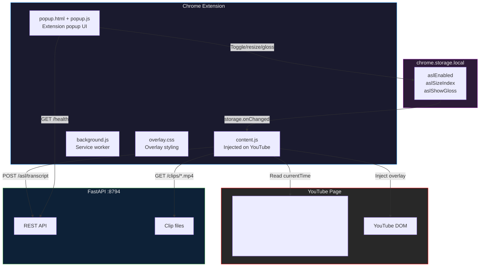
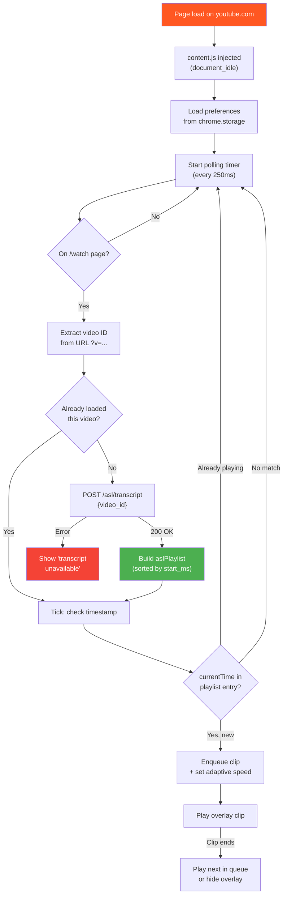
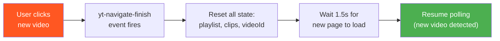
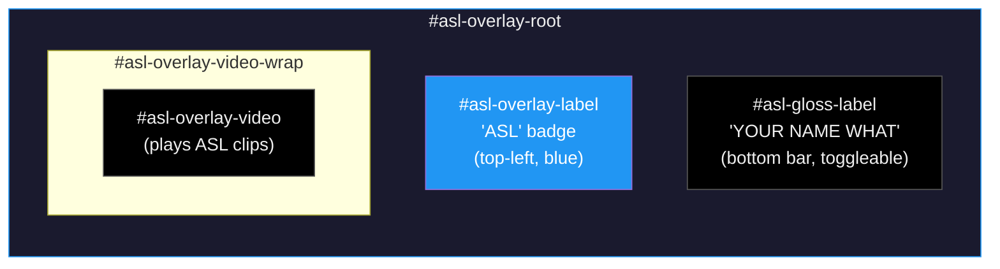
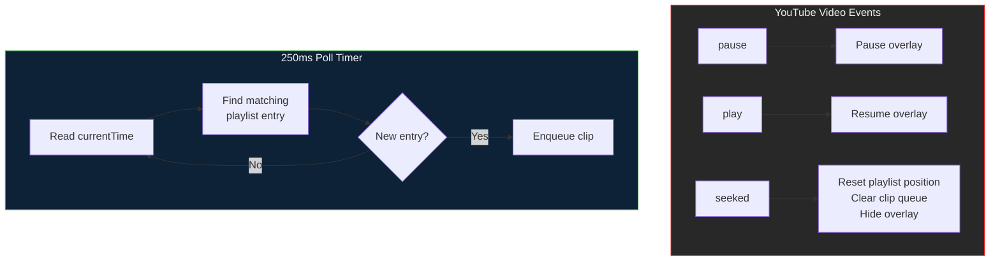

# Chrome Extension

> **Directory:** `chrome-extension/`  
> **Manifest:** Manifest V3  
> **Target:** YouTube (`https://www.youtube.com/*`)

## Overview

The GenASL Chrome Extension is the user-facing delivery mechanism. It injects a Picture-in-Picture ASL overlay onto YouTube video pages, fetches the full transcript and translation from the local FastAPI server, and plays timed ASL clips synchronized with the YouTube video playback — including pause, play, seek, and speed synchronization.

---

## Extension Architecture



---

## Content Script Lifecycle



---

## SPA Navigation Handling

YouTube is a Single-Page Application (SPA). Navigating between videos doesn't trigger a full page reload. The extension listens for YouTube's custom navigation event:



On `yt-navigate-finish`:
- `aslPlaylist = []`
- `transcriptLoaded = false`
- `currentVideoId = null`
- `ytVideoListenersAttached = false`
- Clip queue cleared, overlay hidden

---

## Overlay DOM Structure

The extension injects a DOM structure into the YouTube player container:

```
#movie_player (YouTube's player)
└── #asl-overlay-root (overlay container)
    ├── #asl-overlay-video-wrap
    │   └── #asl-overlay-video (<video> element)
    ├── #asl-overlay-label ("ASL" badge)
    └── #asl-gloss-label (gloss text bar)
```



### Position & Sizing

| Property | Value |
|----------|-------|
| **Position** | Bottom-right of YouTube player, 60px above controls |
| **Z-index** | 2147483647 (maximum) — beats all YouTube layers |
| **Background** | `rgba(0, 0, 0, 0.65)` — semi-transparent |
| **Border radius** | 10px |
| **Transition** | 0.3s opacity fade in/out |
| **Fullscreen** | Adjusts to bottom: 80px, right: 20px |

### Size Presets

| Size | Width | Height | Label |
|------|-------|--------|-------|
| S | 160px | 130px | Small |
| M | 220px | 180px | Medium (default) |
| L | 320px | 260px | Large |
| XL | 420px | 340px | Extra Large |

Sizes use `setProperty("width", ..., "important")` to override YouTube's styles.

---

## Playback Synchronization

The extension maintains tight synchronization between the YouTube video and the ASL overlay:



| Event | Action |
|-------|--------|
| **YouTube pauses** | Overlay video pauses |
| **YouTube resumes** | Overlay video resumes |
| **YouTube seeks** | Reset `lastTriggeredIdx`, clear clip queue, hide overlay |
| **New video (SPA)** | Full state reset, re-fetch transcript |

---

## Extension Popup

The popup provides user controls:

```
┌────────────────────────────┐
│ 🫶 ASL Overlay             │
│                            │
│ Enable overlay     [═══●]  │
│ Show gloss text    [●═══]  │
│ Overlay size    [−] M [+]  │
│                            │
│ ● Server running           │
└────────────────────────────┘
```

### Controls

| Control | Storage Key | Default | Effect |
|---------|-------------|---------|--------|
| Enable overlay | `aslEnabled` | `true` | Show/hide entire overlay |
| Show gloss text | `aslShowGloss` | `false` | Display gloss words below video |
| Overlay size | `aslSizeIndex` | `1` (M) | Resize overlay (S/M/L/XL) |

### Server Health Check

The popup pings `GET /health` on open. Displays:
- 🟢 "Server running" — server reachable
- 🔴 "Server offline — run: python -m src.api.server" — server unreachable

---

## File Structure

```
chrome-extension/
├── manifest.json      Manifest V3 metadata
├── background.js      Service worker (minimal)
├── content.js         Main content script (~340 lines)
├── overlay.css        Overlay styling
├── popup.html         Popup UI layout
├── popup.js           Popup event handlers
└── icons/
    ├── icon48.png     Toolbar icon
    └── icon128.png    Extension page icon
```

### Manifest Permissions

```json
{
  "permissions": ["storage", "activeTab"],
  "host_permissions": [
    "https://www.youtube.com/*",
    "http://127.0.0.1:8794/*"
  ]
}
```

- `storage` — Persist user preferences
- `activeTab` — Send messages to content script
- `youtube.com` — Inject content script
- `127.0.0.1:8794` — Fetch from local API server

---

## Installation

1. Open `chrome://extensions/` in Chrome
2. Enable **Developer mode** (toggle in top-right)
3. Click **Load unpacked**
4. Select the `chrome-extension/` folder
5. Navigate to any YouTube video — the overlay appears automatically

### Requirements

- The FastAPI server must be running: `python -m src.api.server`
- The server popup indicator shows green when connected
