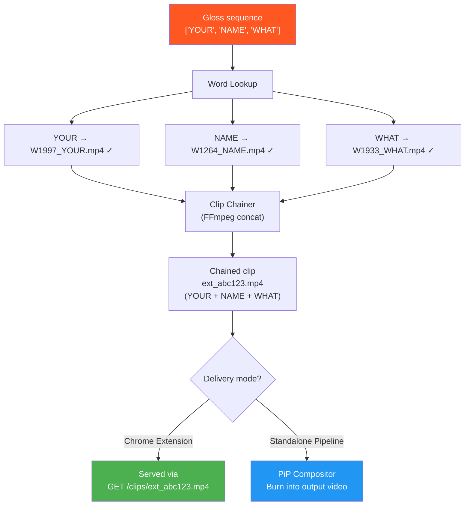
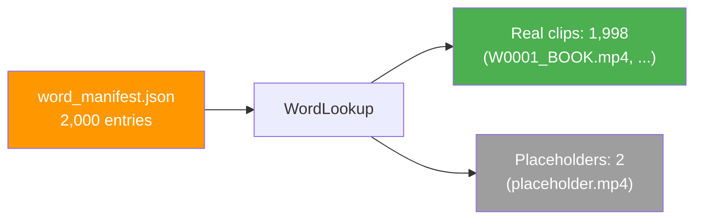
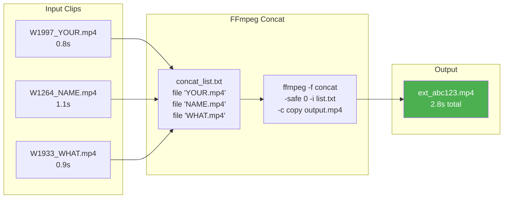
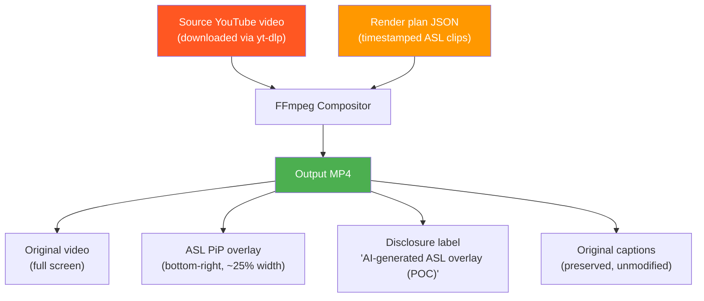

# Clip Chaining & Overlay Delivery

> **Modules:**  
> - `src/gloss/word_lookup.py` — Gloss → clip path resolution  
> - `src/gloss/chainer.py` — FFmpeg concat demuxer  
> - `src/compositor/compositor.py` — PiP overlay compositor (standalone mode)

## Overview

Once the Gloss Translator produces ASL gloss sequences, the pipeline must convert those abstract symbols into playable video. This happens in three steps: **word lookup** (map each gloss to a video file), **clip chaining** (concatenate matched clips into one video), and **overlay delivery** (serve the chained clip to the Chrome extension or compose it into an output video).

---

## End-to-End Flow



---

## Word Lookup (`word_lookup.py`)

### How It Works

The `WordLookup` class reads `assets/word_manifest.json` and builds an in-memory dictionary mapping uppercase gloss words to video clip file paths.



### Word Manifest Structure

```json
{
  "words": [
    {
      "gloss": "HELLO",
      "source": "wlasl",
      "signer_id": 9,
      "clip_path": "assets/words/W0997_HELLO.mp4",
      "duration_ms": 1200
    },
    {
      "gloss": "PASSWORD",
      "source": "placeholder",
      "clip_path": "assets/placeholders/placeholder.mp4",
      "duration_ms": 2000
    }
  ]
}
```

### Lookup Resolution

Given a gloss sequence, `lookup_sequence()` returns detailed results:

```python
lookup = WordLookup()
results = lookup.lookup_sequence(["YOUR", "NAME", "WHAT"])
# → [
#     {"gloss": "YOUR", "found": True,  "path": "assets/words/W1997_YOUR.mp4"},
#     {"gloss": "NAME", "found": True,  "path": "assets/words/W1264_NAME.mp4"},
#     {"gloss": "WHAT", "found": True,  "path": "assets/words/W1933_WHAT.mp4"},
# ]
```

Only entries with `found: True` are passed to the chainer. Missing glosses are logged and reported to the Chrome extension as `missing` words.

### WLASL Dataset Coverage

| Metric | Value |
|--------|-------|
| Total glosses in manifest | 2,000 |
| Real video clips | 1,998 |
| Placeholder clips | 2 (PASSWORD, DO) |
| Primary signer | Signer 9 (asl5200) — 91% coverage |
| Fallback signers | 109, 12, then any |
| Clip specs | 320×240 px, ~25 fps, 0.5–5.0s |

---

## Clip Chainer (`chainer.py`)

### How It Works

The chainer takes a list of word clip paths and concatenates them into a single video using FFmpeg's **concat demuxer**. This avoids re-encoding — it simply joins the streams, which is fast and lossless.



### Chain Process

1. **Build concat list** — Writes a temporary text file listing all clip paths
2. **Run FFmpeg** — Uses concat demuxer (`-f concat -safe 0 -c copy`)
3. **Output** — Single MP4 written to `assets/chained/{clip_name}.mp4`
4. **Return metadata** — `{path, duration_ms, clip_count, glosses}`

### Special Cases

| Scenario | Behaviour |
|----------|-----------|
| **Single clip** | Copies directly instead of concat (no FFmpeg needed) |
| **No clips found** | Returns `None` — no video generated |
| **Output already exists** | Returns immediately (cached) |
| **FFmpeg not found** | `FileNotFoundError` with install instructions |

### FFmpeg Location

The module searches for FFmpeg in order:
1. Winget-installed path: `C:\Users\*\AppData\Local\Microsoft\WinGet\Links\ffmpeg.exe`
2. System `PATH`

---

## Clip Cache (`assets/chained/`)

Chained clips are written to `assets/chained/` with deterministic filenames based on the MD5 hash of the input text:

```
assets/chained/
├── ext_d7bc84eed3dd5a8a8212d1c9a62348eb.mp4   (EASY + ENGLISH)
├── ext_8de4ee2fe7e0d64c152a17bd9d8d0703.mp4   (HELLO + YOUR + NAME)
├── ext_37bef746dd4210acf00c853197f0e215.mp4   (YOUR + NAME)
├── ext_0a56cae1beb422a66f4b95b586ecf303.mp4   (NICE + TO + MEET + YOU)
└── ...
```

Duplicate transcript lines produce the same hash → same file → no redundant FFmpeg work.

---

## PiP Compositor (`compositor.py`) — Standalone Mode

For offline video production, the compositor burns ASL clips directly into the source video as a Picture-in-Picture overlay:



### Compositor Features

| Feature | Detail |
|---------|--------|
| **PiP position** | Bottom-right corner of video frame |
| **PiP size** | ~25% of video width |
| **Disclosure label** | "AI-generated ASL overlay (POC)" — burned in via `drawtext` filter |
| **Original captions** | Never modified or suppressed |
| **Overlap resolution** | Only higher-scoring match shown when clips overlap |
| **Output format** | MP4 (H.264 + AAC) |

### RAI Disclosure Requirement

The disclosure label ("AI-generated ASL overlay (POC)") is burned directly into the video pixels using FFmpeg's `drawtext` filter. It is:
- Visible at all times during playback
- Part of the video itself (not a removable UI element)
- Compliant with CVAA/ADA requirements for AI-generated accessibility content

---

## Adaptive Playback Speed (Chrome Extension Mode)

When serving clips to the Chrome extension, the overlay adjusts playback speed to fit each ASL clip into its caption's time window:

```
playbackRate = clipDurationMs / availableMs

Where:
  clipDurationMs = total duration of the chained ASL clip
  availableMs    = end_ms - start_ms of the transcript segment

Clamped to: [0.7, 2.5]
```

| Example | Clip Duration | Window | Rate | Effect |
|---------|--------------|--------|------|--------|
| Short clip, long window | 1.5s | 5.0s | 0.7x (min) | Plays at minimum speed |
| Perfect fit | 3.0s | 3.0s | 1.0x | Normal speed |
| Long clip, short window | 4.0s | 2.0s | 2.0x | Plays faster to fit |
| Very long clip | 6.0s | 2.0s | 2.5x (max) | Capped at max speed |

---

## Usage

### Word Lookup

```python
from src.gloss.word_lookup import WordLookup

lookup = WordLookup()
print(f"Available: {len(lookup.available_glosses)} real clips")

results = lookup.lookup_sequence(["HELLO", "YOUR", "NAME", "WHAT"])
for r in results:
    status = "✓" if r["found"] else "✗"
    print(f"  {status} {r['gloss']} → {r.get('path', 'missing')}")
```

### Clip Chaining

```python
from src.gloss.chainer import chain_clips

word_entries = [
    {"gloss": "YOUR", "found": True, "path": "assets/words/W1997_YOUR.mp4"},
    {"gloss": "NAME", "found": True, "path": "assets/words/W1264_NAME.mp4"},
]
result = chain_clips(word_entries, "my_clip")
print(f"Chained: {result['path']} ({result['duration_ms']}ms)")
```
