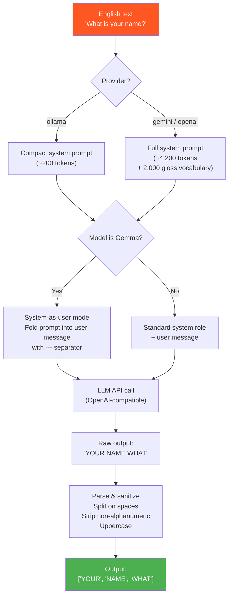
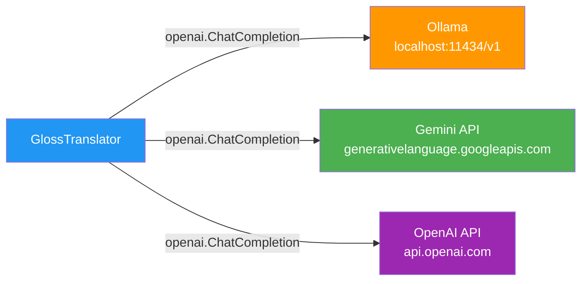
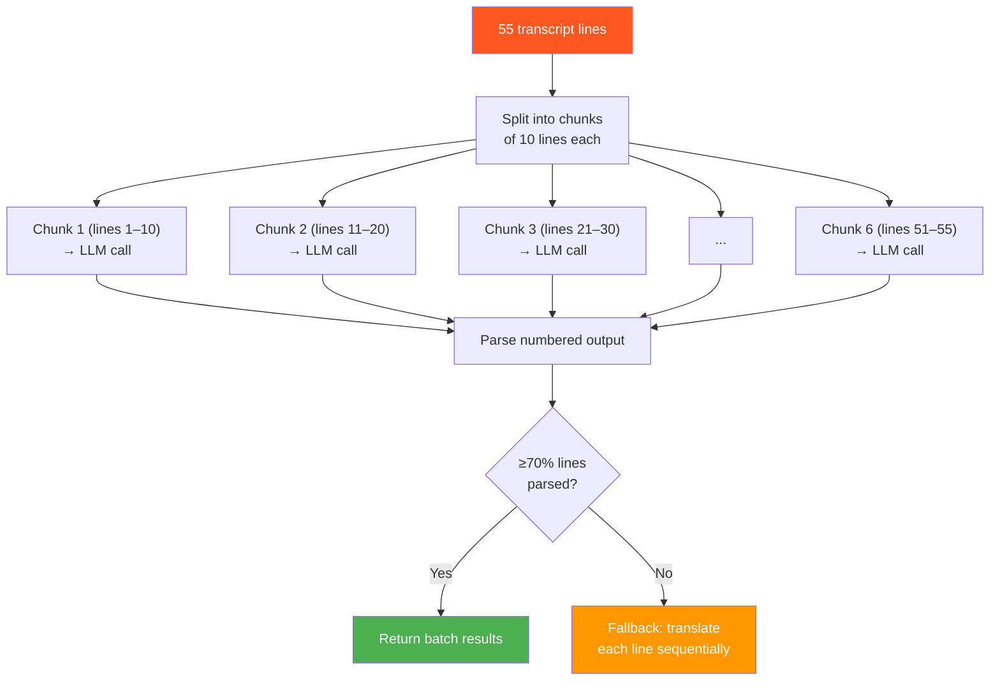

# Gloss Translation Pipeline

> **Module:** `src/gloss/translator.py`  
> **Entry point:** `GlossTranslator.translate(text) → list[str]` / `GlossTranslator.translate_batch(texts) → list[list[str]]`

## Overview

The Gloss Translation Pipeline is the core intelligence layer of GenASL. It converts English sentences into **ASL gloss notation** — a linearized representation of sign sequences — using a Large Language Model (LLM). The translator applies ASL grammar rules during translation, producing output that respects ASL's distinct linguistic structure rather than simply uppercasing English words.

---

## What is ASL Gloss?

ASL gloss is a written representation of sign language where each sign is written as an uppercase English word. ASL has its own grammar that differs significantly from English:

| English | ASL Gloss | Rule Applied |
|---------|-----------|--------------|
| "Where is the library?" | LIBRARY WHERE | Topic-comment; question word at end; drop article + copula |
| "I want to go to the store tomorrow." | TOMORROW STORE GO WANT | Time-first; drop prepositions |
| "What is your name?" | YOUR NAME WHAT | Question word at end; drop copula |
| "She is very happy today." | TODAY SHE HAPPY | Time-first; drop copula + intensifier |
| "Nice to meet you." | NICE MEET YOU | Drop preposition |

---

## Translation Flow



---

## Multi-Provider Support

All three providers are accessed through the same OpenAI-compatible chat API, making the translator provider-agnostic:



### Provider Configuration

| Provider | Model | Base URL | API Key | Prompt Mode |
|----------|-------|----------|---------|-------------|
| **ollama** | gemma3:4b / qwen3:4b | `http://localhost:11434/v1` | `"ollama"` (dummy) | Compact (~200 tokens) |
| **gemini** | gemini-2.0-flash | `generativelanguage.googleapis.com/v1beta/openai/` | `GEMINI_API_KEY` env | Full (~4,200 tokens) |
| **openai** | gpt-4o-mini | Default OpenAI endpoint | `OPENAI_API_KEY` env | Full (~4,200 tokens) |

Selection is configured in `config.yaml`:

```yaml
llm:
  provider: "ollama"    # ollama | gemini | openai
  ollama:
    model: "gemma3:4b"
```

---

## Dual Prompt Strategy

### Compact Prompt (Ollama / Local Models)

~200 tokens. Avoids filling the KV-cache on small models:

```
You are an ASL gloss translator. Convert English to ASL gloss notation.

Rules: topic-comment order, drop articles/copulas/prepositions, time words first,
question words last, NOT after verb, adjectives after noun.

Output ONLY uppercase words separated by spaces. No punctuation or commentary.

Examples:
"Where is the library?" → LIBRARY WHERE
"I want to go to the store tomorrow." → TOMORROW STORE GO WANT
"She is very happy today." → TODAY HAPPY
```

### Full Prompt (Gemini / OpenAI)

~4,200 tokens. Includes the complete list of 2,000 available WLASL glosses to constrain output:

```
You are an expert ASL linguist. Your task is to translate English sentences 
into ASL gloss sequences.

ASL GRAMMAR RULES:
- Topic-comment structure (topic first, then comment)
- Omit articles, copulas, prepositions
- Time indicators at the beginning
- Question words at the END
...

AVAILABLE SIGNS:
ABANDON, ABLE, ABOUT, ABOVE, ACCEPT, ACCIDENT, ... (2,000 glosses)

IMPORTANT: Prefer words from the AVAILABLE SIGNS list above
```

---

## Batch Translation

For the transcript endpoint, all lines are translated together using chunked batch calls:



### Why Chunked Batches?

Small local models (4B parameters) lose translation quality when given too many lines at once — they start simply uppercasing English instead of restructuring it into ASL grammar. Chunking into groups of 10 keeps the model focused while still batching.

### Batch Prompt Format

Each chunk is sent as a numbered list with in-prompt examples:

```
Translate each numbered English sentence to ASL gloss notation.
Apply ASL grammar: topic-comment order, drop articles/copulas,
question words at END, time words at START.
Do NOT just uppercase the English — restructure the sentence.

Examples:
  English: "Where is the library?" → ASL: LIBRARY WHERE
  English: "What is your name?" → ASL: YOUR NAME WHAT
  ...

Now translate these. Output ONLY: number, period, ASL gloss words.

1. Easy English Conversations
2. Hello, what's your name?
3. Hi, I'm Tim.
```

Expected output:
```
1. EASY ENGLISH CONVERSATION
2. HELLO YOUR NAME WHAT
3. HELLO ME NAME T-I-M
```

### Parsing & Fallback

The numbered output is parsed with regex `^(\d+)\.\s*(.+)$`. If fewer than 70% of lines are successfully parsed, the translator falls back to translating each line individually.

---

## Gemma System-as-User Workaround

Gemma models (served via the Gemini API) don't support the `"system"` role in chat messages. The translator detects this (`model.startswith("gemma")`) and folds the system prompt into the user message:

```
[system prompt text]

---
Now translate the following English text to ASL gloss.
Output ONLY the uppercase gloss words, nothing else.

English: "What is your name?"
ASL Gloss:
```

The `---` separator and explicit framing prevent the model from treating caption text as instructions (prompt injection protection).

---

## Output Sanitization

Every gloss word passes through:

```python
re.sub(r'[^A-Z0-9\-]', '', word.strip().upper())
```

This strips all punctuation, special characters, and ensures consistent uppercase formatting. Empty strings after stripping are dropped.

---

## Usage

### Single sentence

```python
translator = GlossTranslator()
glosses = translator.translate("Where is the library?")
# → ["LIBRARY", "WHERE"]
```

### Batch (multiple sentences)

```python
texts = ["Hello!", "What's your name?", "Nice to meet you."]
results = translator.translate_batch(texts)
# → [["HELLO"], ["YOUR", "NAME", "WHAT"], ["NICE", "MEET", "YOU"]]
```

### CLI test

```bash
python -m src.gloss.translator "Where is the library?"
# Output:
# Input:  Where is the library?
# Gloss:  LIBRARY WHERE
```
