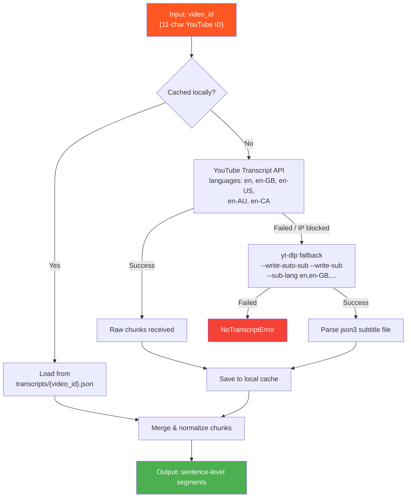
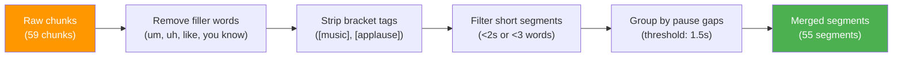

# Transcript Ingestion

> **Module:** `src/transcript_ingestion/fetcher.py`  
> **Entry point:** `fetch_transcript(video_id: str) → List[Dict]`

## Overview

The Transcript Ingestion module is the first stage of the GenASL pipeline. It retrieves timestamped English transcript data from YouTube videos, normalizes the raw caption chunks into clean sentence-level segments, and caches results locally for fast re-use.

---

## Flow Diagram



---

## Input / Output

### Input

A valid 11-character YouTube video ID, e.g. `I_tRSrPru94`.

Validated against: `^[A-Za-z0-9_-]{11}$`

### Output

A list of sentence-level transcript segments:

```json
[
  {
    "segment_id": "SEG_001",
    "start_ms": 2340,
    "end_ms": 5120,
    "text": "Hello, what's your name?"
  },
  {
    "segment_id": "SEG_002",
    "start_ms": 5120,
    "end_ms": 7800,
    "text": "My name is Tim."
  }
]
```

---

## Retrieval Strategy

The module uses a two-tier fallback strategy:

### Tier 1 — YouTube Transcript API (Primary)

```python
YouTubeTranscriptApi().fetch(video_id, languages=["en", "en-US", "en-GB", "en-AU", "en-CA"])
```

- Uses the `youtube-transcript-api` library (v1.2.4)
- Requests transcripts in multiple English locale variants
- Handles both manually-created and auto-generated captions
- Returns raw chunks: `[{text, start, duration}, ...]`

### Tier 2 — yt-dlp Subtitle Download (Fallback)

When the API is blocked (IP restrictions, bot detection), falls back to:

```bash
yt-dlp --skip-download --write-auto-sub --write-sub \
       --sub-lang en,en-US,en-GB,en-AU,en-CA,en-orig \
       --sub-format json3 \
       --cookies cookies.txt \
       --output <tmpdir>/sub \
       https://www.youtube.com/watch?v={video_id}
```

- Downloads subtitle files in `json3` format
- Supports authentication via `cookies.txt` for age-restricted or login-required videos
- Parses the `events[].segs[].utf8` structure from json3

---

## Normalization Pipeline

Raw transcript chunks from YouTube are short, overlapping, and noisy. The normalization pipeline merges them into clean sentence-level segments:



### Normalization Steps

| Step | Description | Example |
|------|-------------|---------|
| **Filler removal** | Strips common fillers: um, uh, like, you know, so, well | "um what's your name" → "what's your name" |
| **Bracket stripping** | Removes auto-caption tags | "[music] hello" → "hello" |
| **Short segment filter** | Drops segments <2 seconds or <3 words | "cc." → filtered |
| **Pause-gap grouping** | Merges consecutive chunks with <1.5s gap into one segment | 3 short chunks → 1 sentence |

---

## Local Caching

Fetched transcripts are cached to `transcripts/{video_id}.json` after the raw chunks are retrieved. This avoids re-fetching from YouTube on subsequent runs.

```
transcripts/
├── I_tRSrPru94.json     (Easy English Conversations Ep 1)
├── 31y2Bq1RYQA.json     (Easy English Conversations Ep 2)
├── on_1sS6Ii8M.json     (Easy English Conversations Ep 3)
└── ...
```

Cache lookup happens **before** any network call, so cached videos load instantly.

---

## Error Handling

| Scenario | Behaviour |
|----------|-----------|
| Invalid video ID | `ValueError` raised immediately |
| No English transcript exists | `NoTranscriptError` raised |
| YouTube API blocked (IP) | Falls back to yt-dlp silently |
| yt-dlp also fails | `NoTranscriptError` with details |
| Authentication required | Error message includes `cookies.txt` setup instructions |

The `NoTranscriptError` is a custom exception defined in the module. The API server catches it and returns a 404 JSON response to the Chrome extension, which displays "ASL: transcript unavailable".

---

## Configuration

No direct config.yaml entries — the module reads `video_id` from its caller. However, it uses:

- `cookies.txt` in the project root for authenticated yt-dlp requests
- `transcripts/` directory for local caching

---

## Usage

### As a library

```python
from src.transcript_ingestion.fetcher import fetch_transcript, NoTranscriptError

try:
    segments = fetch_transcript("I_tRSrPru94")
    for seg in segments:
        print(f"[{seg['start_ms']}–{seg['end_ms']}] {seg['text']}")
except NoTranscriptError as e:
    print(f"No transcript: {e}")
```

### From the command line

```bash
python -m src.transcript_ingestion.fetcher I_tRSrPru94
```
